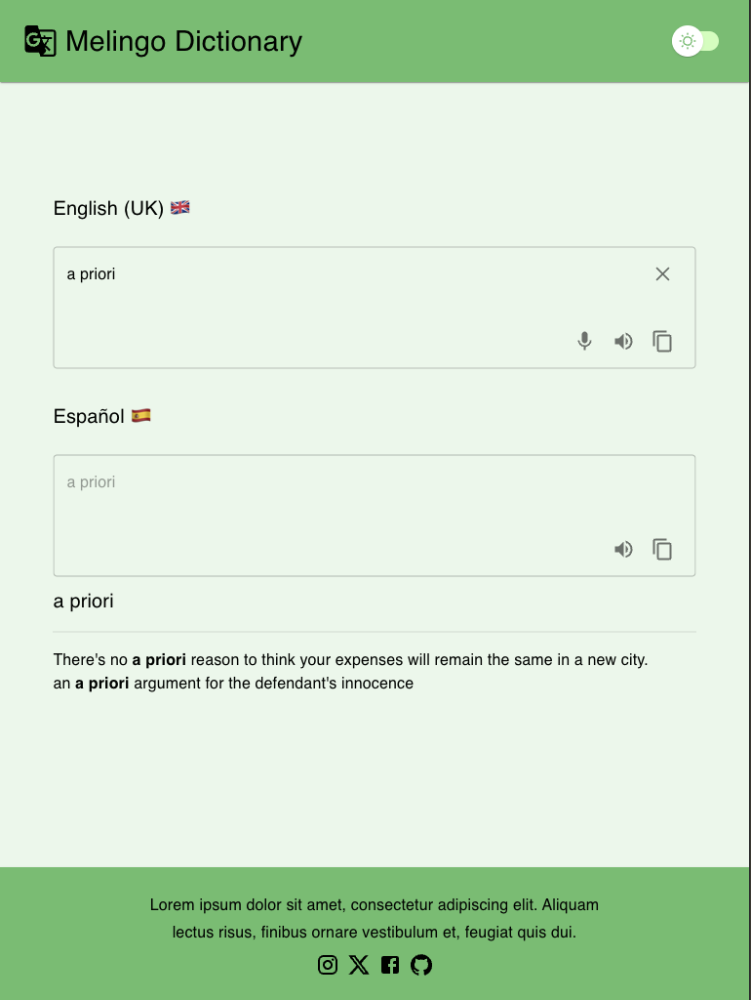
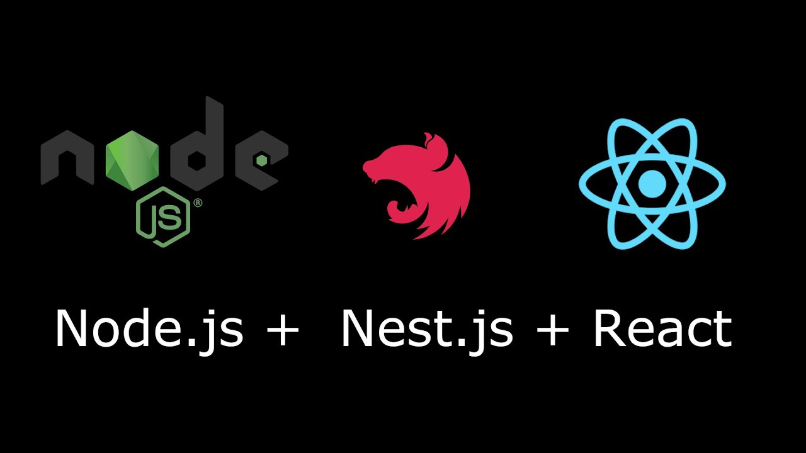

# Melingo Dictionary

<picture>
  
</picture>

## Description

Dictionary that helps to translate words/phrases from English to Spanish.
It also provides examples of usage

<picture>
  
</picture>

## Tech stack
<picture>
  
</picture>

## Installation

### Frontend packages
switch to `fe` directory and run:
`npm install`

### Backend packages
switch to `be` directory and run:
`npm install`

## Application Running

### run with Docker `docker compose up` 
(runs fe be and database)

### development
* run client: switch to `fe` directory and run:
  `npm run dev`
* run server: switch to `be` directory and run:
    `npm run start:dev`

## Development

### Client
* to create a component or page just use cli `npm run generate` and answer following questions

### Server
* to create/run/revert/check status migrations use scripts:
  * `npm run migration:create migrations/<migration_name>`
  * `npm run migration:run`
  * `npm run migration:revert`
  * `npm run migration:show`

## License

only driver

---